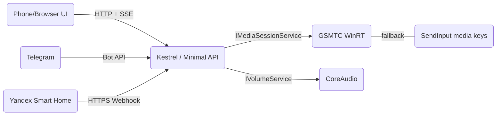

<div align="center">
  


# 🎛️ **sharpmote** — tiny LAN remote for Windows media

</div>

> You press button on phone — PC say: *«да, товарищ»*.  
> Fast like bear on ice, simple like hammer. No Electron, no webpack circus. One `.exe`, чистые HTML/CSS/JS inside.

---

## 📦 TL;DR

- Control any player that publish **System Media Controls** (browser tabs with audio, Spotify, etc.).
- Volume master via CoreAudio (mute, set %).
- Local **web UI** with big buttons, mobile-friendly.
- **SSE** live updates, no polling.
- **API with X-Api-Key**, rate limiting, JSON logs.
- **Telegram bot** (webhook or long-polling).
- **Yandex Smart Home** device (on/off, volume, mute).
- Small album art thumbnail (if app provide).
- Run as **Windows Service** (but must be interactive user, not cold session 0).

---

## 🏗️ What inside (very modern, very fast)

- **.NET 9** Minimal API, Kestrel tuned
- **GSMTC** (`Windows.Media.Control`) for media sessions (event-driven, not heavy poll)
- Fallback to **SendInput** media keys if app not expose GSMTC actions
- **NAudio/CoreAudio** for volume/mute
- **SSE** bus for UI: `state`, `track`, `volume`
- **Source‑generated JSON** (less reflection, more speed)
- Embedded **wwwroot** → single-file `.exe` with UI
- Clean structured logs (JSON): `module, action, reason, recommendation, trace_id, request_id, client_ip`

Mermaid say architecture:



---

## ⚙️ Config — put file near EXE

Create file `sharpmote.conf` рядом с `sharpmote.exe` (same folder). One line = one var:

```
SHARPMOTE_API_KEY=dev-key
SHARPMOTE_HTTP_PORT=8080
SHARPMOTE_BIND_ADDRESS=0.0.0.0
SHARPMOTE_LOG_LEVEL=Information

SHARPMOTE_PUBLIC_BASE_URL=            # for webhooks (https)
SHARPMOTE_TELEGRAM_BOT_TOKEN=         # 123456:ABCDEF...
SHARPMOTE_TELEGRAM_ALLOWED_IDS=       # CSV chat/user ids: 111111111,222222222
SHARPMOTE_TELEGRAM_WEBHOOK_SECRET=    # optional, enables webhook mode
SHARPMOTE_YA_OAUTH_DEV_TOKEN=         # optional dev Bearer for Yandex Smart Home
```

App reads this file on startup and also export same values to environment.

---

## 🚀 Run

1. Download release (zip), unzip.
2. Put `sharpmote.conf` near EXE (see sample in release).
3. Start:
   ```powershell
   .\sharpmote.exe
   ```
4. Open from phone on same Wi‑Fi:
   ```
   http://<PC-IP>:8080/
   ```
5. UI works from same origin, API requires header `X-Api-Key: <your key>`.

Open Windows firewall if need:
```powershell
New-NetFirewallRule -DisplayName "sharpmote 8080" -Direction Inbound -Action Allow -Protocol TCP -LocalPort 8080
```

> Service mode possible: `sc.exe create Sharpmote binPath= "<fullpath>\sharpmote.exe" start= auto obj= ".\User" password= "Pass"`  
> But remember: must run as **interactive user**, session 0 cannot see user’s media.

---

## 📡 HTTP API (short & sweet)

Base: `/api/v1` (send header `X-Api-Key`).

- `GET /state` → current playback/app/title/artist/album, `position_ms`, `duration_ms`, `volume`, `mute`  
- `POST /play | /pause | /toggle | /next | /prev | /stop` → `{ "ok": true }`  
- `POST /volume/step` body `{ "delta": 0.05 }` (±5%)  
- `POST /volume/set` body `{ "level": 0.40 }` (0..1)  
- `POST /volume/mute`  
- `GET /albumart` → tiny image stream (204 if none)  
- `GET /events` → Server‑Sent Events: `state`, `track`, `volume`

cURL:
```bash
curl -H "X-Api-Key: dev-key" http://localhost:8080/api/v1/state
curl -X POST -H "X-Api-Key: dev-key" http://localhost:8080/api/v1/toggle
curl -X POST -H "X-Api-Key: dev-key" -d "{\"level\":0.25}" http://localhost:8080/api/v1/volume/set
```

---

## 🤖 Telegram

In `sharpmote.conf` set:
```
SHARPMOTE_TELEGRAM_BOT_TOKEN=123456:ABC...
SHARPMOTE_TELEGRAM_ALLOWED_IDS=111111111,222222222
# optional:
SHARPMOTE_PUBLIC_BASE_URL=https://your.host
SHARPMOTE_TELEGRAM_WEBHOOK_SECRET=supersecret
```

- If `WEBHOOK_SECRET` set → webhook mode at `POST /telegram/webhook/<secret>` (HTTPS!).  
- Else → long polling background service.

Commands:
```
/play /pause /toggle /next /prev /stop
/volup /voldown /vol 0..100 /mute
```
Message edited in place, small inline keyboard, plus **🔄 Refresh** button to read current numbers.

---

## 🧠 Yandex Smart Home

Endpoints (must be HTTPS):
```
POST /yandex/v1.0/user/devices
POST /yandex/v1.0/user/devices/query
POST /yandex/v1.0/user/devices/action
POST /yandex/v1.0/user/unlink
```
Auth: `Authorization: Bearer <token>` (for dev you can use `SHARPMOTE_YA_OAUTH_DEV_TOKEN`).  
Capabilities:
- `devices.capabilities.on_off` → play/pause
- `devices.capabilities.range` instance=**volume** (0..100, step 5)
- `devices.capabilities.toggle` instance=**mute**

---

## 🧪 Manual test checklist

- Open `http://<host>:8080/` from phone, press ⏯ — music toggles
- Check `GET /state` — see title/artist/app, position grows
- Move slider in UI — see volume update and SSE `volume` event
- Telegram: press 🔄 Refresh — message update, shows current %
- Yandex: send `action` volume=30 — API returns `DONE`
- No active media? `GET /state` returns `409` (normal)

---

## 🔍 Troubleshooting

- **No control in service mode** — run under interactive account or just run as console at logon.
- **Album art empty** — app not provide thumbnail, endpoint returns 204.
- **Telegram silent** — check Allowed IDs & token; webhook *or* polling (not both).
- **Can’t open from phone** — firewall rule + `SHARPMOTE_BIND_ADDRESS=0.0.0.0`.
- **Duration zero** — some sources don’t report length; we still show elapsed estimate.

---

## 🏗️ Build from source

Need .NET 9 SDK.

```powershell
dotnet restore
dotnet publish .\sharpmote.csproj -c Release -r win-x64 --self-contained true `
  -p:PublishSingleFile=true -p:PublishTrimmed=false -o .\publish
```

`wwwroot` embedded into exe, nothing else required.

---

## ☕ Small philosophy

We make tool not heavy, not noisy. Works fast, gives control, no drama.  
If want feature — open issue, we discuss, we do. Хорошо будет.
